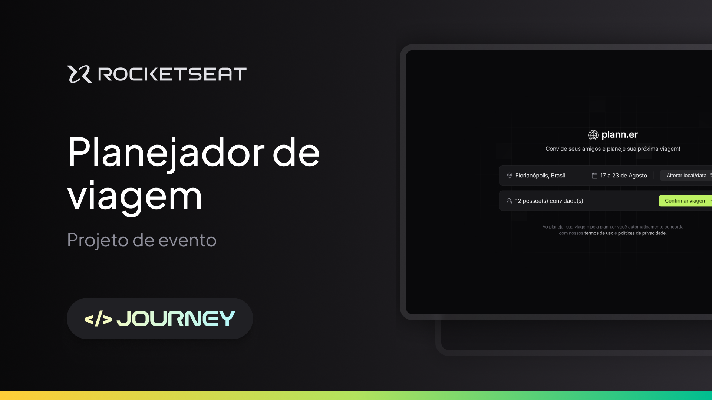

<h1 align="center">Plann.r</h1>

  

 

 
 

## 💻 Projeto 

Este projeto foi desenvolvido durante o evento NLW Journey da Rocketseat. É um site desktop para montar planos de viagem com amigos, registrar atividades e armazenar links úteis.

 
 

### &nbsp;&nbsp;&nbsp;&nbsp; Front-End

- **TypeScript**
- **React JS**
- **Tailwind CSS** - Framework CSS para estilização em classes
- **NextJs** - Ferramenta para gerar estrutura de código para front-end
- **Date-fns** - Lib para trabalhar com datas
- **Radix UI** - Lib de componentes sem qualquer estilização com foco em acessibilidade
- **Tailwind Merge** - Unir classes CSS
- **Axios** - Lib para acessar API
- **React Query** - é frequentemente descrito como a biblioteca de busca de dados ausente para aplicativos da web, mas em termos mais técnicos, facilita muito a busca, o armazenamento em cache, a sincronização e a atualização do estado do servidor em seus aplicativos da web.

 
 

## 🔒 Licença

Esse projeto está sob a licença MIT.

